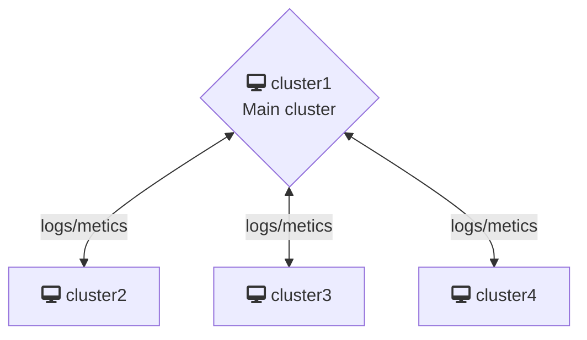

# Instruction

This repo contains a demo setup for federated monitoring using the LGTM stack with two local clusters `cluster1` and `cluster2`. The architecture should be the following:

Prerequisite:
  - docker
  - helm
  - kubectl
  - kind
  - kubectx
  - kubens

## Deploy two kind cluster
https://submariner.io/getting-started/quickstart/kind/#deploy-kind-with-submariner-locally
