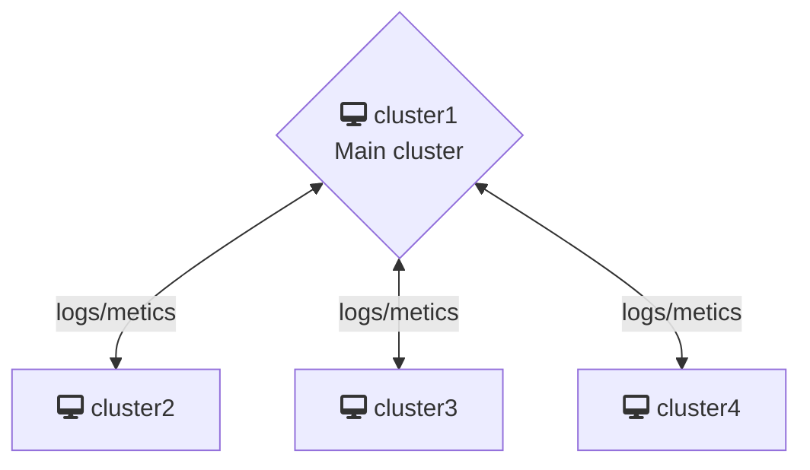

# Federated Kubernetes Monitoring
## Instruction

This repo contains a demo setup for federated monitoring (no alerting) using the LGTM stack with two local clusters `cluster1` and `cluster2`. The architecture should be the following:

The main cluster should contain `Grafana`, `Mimir`, `Loki`, `Prom Agent` and `Promtail`.
The child cluster should contain only contain `Prom Agent` and `Promtail`.

## Prerequisite
  - docker
  - helm
  - kubectl
  - kind
  - kubectx
  - kubens

## Deploy two kind cluster
For the sake of the demo, we need two kind cluster and has communication between them. Networking configuration is not part of the focus here, so I have decided to use a easy solution with submariner but there should be a cleaner setup with kind directly.

`https://submariner.io/getting-started/quickstart/kind/#deploy-kind-with-submariner-locally`

After following the tutorial here, we should have two cluster `cluster1` and `cluster2` that has communication enabled between them, you should able to spin a nginx pod in one cluster and test to curl the ip/dns from another pod.

### Components
#### Grafana
This is the unique frontend for all the monitoring we have here.
#### Mimir
A scallable timeseries database to store all the metrics send by the different Prom Agent, used as backend for Grafana to query metrics and dashboard. Object storage backend.
#### Loki
A centralized database to store all the logs from Promtail.
#### Prom Agent
A Prometheus Agent installed in each cluster that only forwards the metrics to Mimir.
#### Promtail
A logging Agent that forwards the local logs to Loki.

